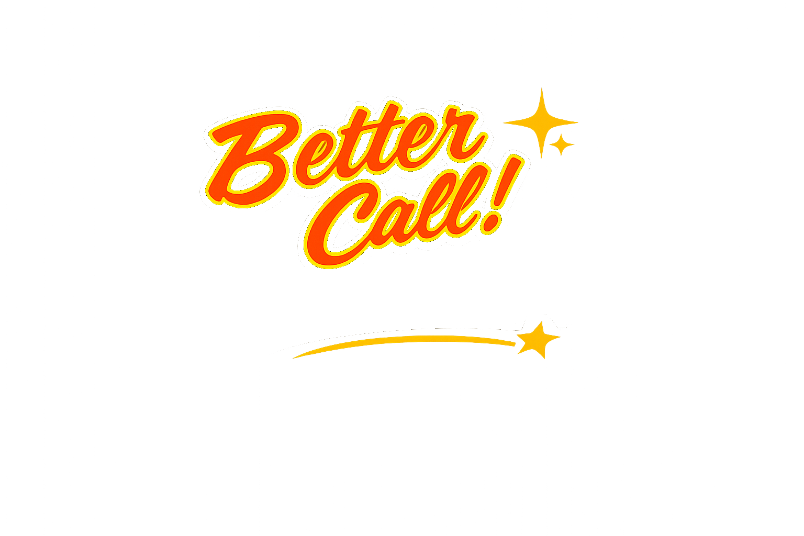
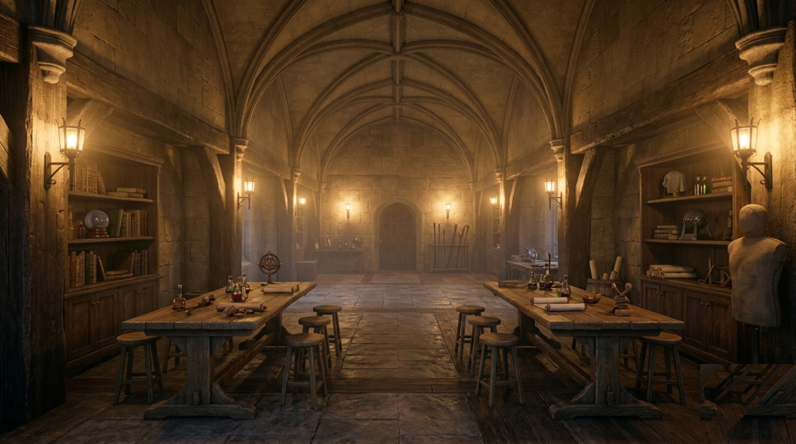

<p align="center">
  
</p>

<div align="center">

# Better Call CineCrew: Consistent Ultra-Long Narrative-to-Film Generation

[](https://eccv.ecva.net/)
[](https://ironieser.github.io/CineCrew/)
[](https://github.com/Ironieser/CineCrew)
[](LICENSE)
<!-- [](https://arxiv.org/abs/XXXX.XXXXX) -->

**Jiaben Chen**<sup>1\*</sup> · **Sixun Dong**<sup>1\*</sup> · Qinhong Zhou<sup>1</sup> · Raine Ma<sup>1</sup> · Zhiyang Dou<sup>2</sup> · Wojciech Matusik<sup>2</sup> · Chuang Gan<sup>1†</sup>

<sup>1</sup> University of Massachusetts Amherst &nbsp;&nbsp; <sup>2</sup> Massachusetts Institute of Technology<br>
<sub>\* equal contribution &nbsp; † corresponding author</sub>

</div>

<p align="center">
  <br>
  <em>CineCrew is a structured orchestration layer for narrative-to-film generation. At its center is
  FilmDSL, a film-oriented domain-specific language that explicitly encodes cinematic constraints —
  shots, camera directives, assets, and character personas — so that a crew of agents coordinates
  through one shared specification for planning, generation, critique, and repair.</em>
</p>

---

## 🚀 Overview

Long-form narrative-to-film generation requires **shot-level controllability** and
**cross-clip consistency** in both visual identity and character behavior —
requirements that remain difficult to satisfy with prompt-based workflows. A core
reason existing workflows stay brittle is the lack of a structured intermediate
layer between scripts and video models, especially when screenplays are
underspecified at key cinematic decision points.

**CineCrew** is a structured orchestration layer for film-oriented script-to-video
generation, implemented as a multi-agent framework that operates between scripts
and off-the-shelf video generators. The layer is centered on **FilmDSL**, a
film-oriented domain-specific language that makes cinematic constraints explicit —
shot and camera directives, asset and continuity requirements, and persona cues —
so that agents coordinate through a shared structured specification for planning,
generation, critique, and repair. A generation agent constructs asset packs and
storyboard keyframes that anchor composition before clip-by-clip synthesis, while a
critic agent produces structured QA signals and triggers targeted refinement
without retraining the base model.

Under this layer, consistency is treated as a **first-class objective rather than an
emergent property of prompting**: appearance and persona requirements are specified
by DSL-defined constraints *before* generation begins, and failures are diagnosed
and repaired with feedback aligned with film-production needs.

## ✨ Key Highlights

- **A structured orchestration layer** for film-oriented script-to-video generation
  that bridges long-form screenplays and off-the-shelf video models, explicitly
  modeling cinematic structure and continuity constraints to enable controllable and
  consistent long-form video synthesis.
- **FilmDSL**, a domain-specific language designed specifically for film generation.
  FilmDSL converts screenplays into a machine-actionable representation of cinematic
  intent — shot structure, camera directives, assets, continuity links, and
  character-direction signals — and embeds two structured memories: a **multi-modal
  asset memory** that preserves visual entities across clips and a **workflow memory**
  (the Production Rulebook) that tracks narrative state and long-range dependencies.
- **A multi-agent film generation framework unified by FilmDSL**, where the DSL serves
  as the shared operational protocol for all agents — Showrunner, Art Department,
  Story Editor, Acting Coach, Cinematographer, Technical Director, Production
  Operator, Dailies Reviewer, VO Director, Post Supervisor — governing planning,
  generation, critique, and refinement within a single structured workflow.
- **Appearance and persona consistency by construction.** Character assets and prop
  persistence are bound across clips; a DSL-embedded **Persona Schema** maps
  persistent traits to observable behavior and specifies beat-level performance
  (emotion arcs, blocking, micro-actions), so multi-character scenes align actions
  with narrative roles, not merely with visual identity.
- **Keyframe-first, coarse-to-fine production loop.** Storyboard keyframes anchor
  identity, layout and look before video synthesis; the Dailies Reviewer diagnoses
  identity drift, prop disappearance / teleportation, keyframe mismatch and temporal
  instability, and proposes targeted edits to FilmDSL fields — directable and
  repairable without retraining the underlying video model.
- **Model-agnostic by design.** Every generator is called through the OpenAI API
  shape, so the same FilmDSL drives Qwen-Image / Wan 2.2 (used in the paper), FLUX,
  Sora, or any self-hosted backend.

## 📅 News

- **2026.09** — Code, examples and project page released.
- **2026** — *Better Call CineCrew* accepted to **ECCV 2026**.

## 🏗️ Architecture

CineCrew is organized as a film-production-style pipeline with role-specialized
modules ("crew") that collaboratively compile a narrative into executable
generative controls and iteratively refine outputs, spanning **pre-production**,
**production** and **post-production**:

```
pre-production   Showrunner ─▶ meta m        Art Department ─▶ asset library A       Production Rulebook M
                 Story Editor ─▶ beats  ─▶  Acting Coach ─▶ Cinematographer ─▶ Technical Director  ─▶  FilmDSL D
production       Production Operator: keyframe k_i ─▶ clip v_i        Dailies Reviewer: QA report ─▶ revise & retry
post-production  VO Director (dialogue → voice track)        Post Supervisor (merge, subtitles, sound layers)
```

**FilmDSL** is stored as a single merged JSON object `D = {meta, assets, memory, clips[]}`.
Pre-production artifacts are not merely external context: they are referenced and
enforced through FilmDSL as global headers and per-clip constraints.

| FilmDSL component | Produced by | Contents |
|---|---|---|
| **Meta `m`** (global headers) | Showrunner | Production-wide constraints and style priors — FPS, aspect ratio, tone, era, location, cast — inherited by every clip |
| **Asset library `A`** | Art Department | Character sheets (identity anchors, wardrobe, a compact **Persona Schema**) and set assets, recorded as stable references (`char_*`, `loc_*`, `prop_*`) |
| **Production Rulebook `M`** | all crew | Static domain priors (staging heuristics, anti-hallucination / anti-spawning constraints, naming conventions) plus runtime feedback from the evaluation–retry loop, injected selectively into each role |
| **Clip spec `d_i = (a_i, s_i, r_i)`** | see below | One entry per clip, three layers |
| &nbsp;&nbsp;Layer 1 — Narrative Action `a_i` | Story Editor (+ Acting Coach, VO Director) | What happens: action, emotion, dialogue; beat-level performance cues |
| &nbsp;&nbsp;Layer 2 — Cinematic Staging `s_i` | Cinematographer (+ DSL Validator) | How it is filmed: shot type, camera move, framing, lighting, structured entities/props, and continuity hooks binding the clip to assets and memory |
| &nbsp;&nbsp;Layer 3 — Render Specification `r_i` | Technical Director | Tool-ready instructions: keyframe prompt, video prompt, negative prompt, generator arguments (duration, FPS, aspect ratio, seed) |

**Production loop.** For each clip the Production Operator first synthesizes a
storyboard-like keyframe `k_i` conditioned on the asset references and memory
constraints, then runs the video generator on `(k_i, video_prompt)` — the
audio-video branch for dialogue clips, the video branch otherwise. The **Dailies
Reviewer** reviews the result and, on rejection, proposes targeted edits (continuity
fields first, then keyframe prompt, then video prompt) and the clip is re-rendered;
each refinement is recorded into the Rulebook state so corrections persist across
clips. Finally the **Post Supervisor** assembles the long-form sequence.

<details>
<summary><b>Crew ↔ code map</b> (<code>src/agents/</code>)</summary>

| Crew member | Package | What it writes |
|-------------|---------|----------------|
| **Showrunner** + **Art Department** | `art_department/` | Meta `m` (`project_settings.yaml`) and the asset library `A` (characters with appearance + persona, locations, props); reference sheets / establishing shots via `generate_references` |
| **Story Editor** | `story_editor/` | Layer 1 — narrative action, emotional beat, dialogue |
| **Cinematographer** | `cinematographer/` | Layer 2 — shot scale / angle / movement / lighting / entities / continuity constraints |
| **DSL Validator** | `dsl_validator/` | Enforces the asset-ID contract on Layer 2: validate → remap near-misses → LLM repair → drop unknowns |
| **VO Director** + **Acting Coach** | `vo_director/` | Layer 1 refinement — dialogue recovery, voice identity (`voice_design`), per-shot performed emotion from line, persona and staging |
| **Technical Director** | `technical_director/` | Layer 3 — keyframe (T2I / TI2I) and video (I2V) prompts resolved against the assets |
| **Dailies Reviewer** | `dailies_reviewer/` | Prompt critic over a 5-shot window before rendering; `VisualJudge` (VLM) on every rendered keyframe / clip |
| **Production Operator** + **Post Supervisor** | `production_operator/` | Assembly layer + `VideoJobBatch`; opt-in execution loop (keyframe → judge → clip → judge) and the final cut |

The code's `SceneBlueprint` (`src/schemas/blueprint.py`) is FilmDSL as a Pydantic
model; it adds an explicit Layer 4 (assembly: transitions, audio tracks) as the
Post Supervisor's hand-off. The Production Rulebook lives in `configs/knowledge/`.
See [`DEV_NOTES.md`](DEV_NOTES.md) for the full mapping and
[`AGENTS.md`](AGENTS.md) for a guided tour of the code base.

</details>

## 📦 Installation & Usage

### Quick start

```bash
git clone https://github.com/Ironieser/CineCrew.git
cd CineCrew
python -m venv .venv && source .venv/bin/activate     # Python 3.10+
pip install -r requirements.txt

cp .env.example .env         # then put your LLM key in .env
python run_dataset_story.py our_dataset/BetterCallSaul2
```

That runs the whole crew on a bundled two-character scene and writes the plan to
`data/runs/dataset/BetterCallSaul2/<run_id>/`. Only an LLM key is required —
image / video backends are optional and off by default. `ffmpeg` (with `ffprobe`)
is needed only for execution (frame sampling for the visual judge, cutting the film).

### Configuration

Everything is configured through environment variables (a `.env` file at the
project root is loaded automatically; see [`.env.example`](.env.example)). No
secrets are ever stored in the repo.

All three model roles speak the **OpenAI API shape**, so OpenAI, Azure OpenAI,
vLLM, Ollama, LiteLLM, or a self-hosted wrapper are interchangeable — point the
`*_BASE_URL` at the server and name the `*_MODEL` it serves.

| Role | Endpoint used | Variables | Default |
|------|---------------|-----------|---------|
| **LLM** (the crew) | `POST {LLM_BASE_URL}/chat/completions` | `LLM_API_KEY` (required), `LLM_BASE_URL`, `LLM_MODEL`, `LLM_PROVIDER` (`openai` \| `azure`), `AZURE_API_VERSION` | `api.openai.com`, `gpt-5` |
| **T2I** (keyframes, reference sheets) | `POST {T2I_BASE_URL}/images/generations` (+ `/images/edits`) | `T2I_MODEL`, `T2I_BASE_URL`, `T2I_API_KEY`, `T2I_SIZE`, `T2I_KEYFRAME_SIZE` | self-hosted **Qwen-Image**: `qwen-image` @ `http://localhost:8000/v1` |
| **Video** (T2V / I2V) | `POST {VIDEO_BASE_URL}/videos` + poll / download | `VIDEO_MODEL`, `VIDEO_BASE_URL`, `VIDEO_API_KEY`, `VIDEO_SIZE`, `VIDEO_FPS`, `VIDEO_TIMEOUT` | self-hosted **Wan 2.2**: `wan22-t2v` @ `http://localhost:8090/v1` |

The paper's results use Qwen-Image (T2I) and Wan 2.2 (T2V / I2V), which is why
they are the defaults; `T2I_API_KEY` / `VIDEO_API_KEY` fall back to `LLM_API_KEY`.
Swapping in OpenAI's `gpt-image-1` / `sora-2` or any other model is just a
different `*_MODEL` + `*_BASE_URL`.

Other switches: `LLM_MAX_RETRIES` (default `2`; `0` = fail-fast), `LLM_TIMEOUT`
(seconds per request, default `600`), `LLM_MAX_COMPLETION_TOKENS` (default `32768`),
`TRACE_LOGS=0` (disable per-agent trace logs), `DISABLE_KNOWLEDGE=1` (ablation: no
Production Rulebook injection).

<details>
<summary><b>Example <code>.env</code> files</b> (OpenAI · Azure OpenAI · local vLLM / Ollama)</summary>

```ini
# OpenAI
LLM_API_KEY=sk-...
LLM_MODEL=gpt-5
```

```ini
# Azure OpenAI
LLM_PROVIDER=azure
LLM_API_KEY=...
LLM_BASE_URL=https://<resource>.openai.azure.com
LLM_MODEL=<deployment-name>
AZURE_API_VERSION=2024-10-21
```

```ini
# Local OpenAI-compatible server (vLLM, Ollama, ...)
LLM_API_KEY=EMPTY
LLM_BASE_URL=http://localhost:8000/v1
LLM_MODEL=Qwen/Qwen3-235B-A22B
```

</details>

### Running the pipeline

```bash
python run_dataset_story.py <story_dir>                       # a story directory
python run_dataset_story.py <collection>.json --moment <id>   # one scene of a moments collection
python run_dataset_story.py <story_dir> --skip dailies_reviewer   # turn any stage off from the CLI
python run_dataset_story.py <story_dir> --execute             # also render, judge and cut the film
```

A story directory contains a script and, optionally, one reference image per
character — characters without one (and all locations) get a rendered reference
when `art_department.generate_references: true`:

```
our_dataset/<Story>/
├── script_synopsis.json             { "MovieScript": "...", "Character": ["Saul", "Judge"] }
└── character_list/<Name>/best.png   reference image (linked to the matching character asset)
```

Which stages run, and in what order, is `configs/pipeline_settings.yaml`
(`pipeline.stages`). Every stage is a one-line `enabled: false` away from being
skipped, which is also how the ablations are run.

Programmatic use:

```python
from src.pipeline import run_pipeline
ctx = run_pipeline(open("script.txt").read(), run_root="data/runs/my_story")
blueprint  = ctx["scene_blueprint"]   # FilmDSL (SceneBlueprint)
video_jobs = ctx["video_jobs"]        # VideoJobBatch
```

### Outputs

```
data/runs/dataset/<story>/<run_id>/
├── assets/   asset_library.json, project_settings.json, characters/, locations/, props/
├── shots/    scene_blueprint_final.json   ← FilmDSL, all four layers
│             video_jobs.json              ← VideoJobBatch: executable T2V/I2V job specs
│             validation_report.json       ← asset-ID checks + repairs made by the DSL validator
│             dailies_report.json          ← what the prompt critic changed
│             video_results.json           ← only when execute: true
├── media/    keyframes/, clips/, frames/, film.mp4  ← only when execute: true
└── logs/     one markdown trace per agent call + index.md
```

### Execution and VLM review

The blueprint is a complete plan; turning it into pixels is a separate, opt-in
step so that planning stays cheap and backend-agnostic. With
`production_operator.execute: true` (or `--execute`) the Production Operator runs
a ReAct loop per shot:

```
keyframe  = T2I / TI2I(resolved prompt [+ character reference sheets])  ─┐
            VisualJudge (VLM) → accepted?  else retry with its revised prompt ┘  ≤ max_retries
clip      = I2V(keyframe, resolved_i2v)                                    ─┐
            sample frames → VisualJudge → accepted?  else retry              ┘  ≤ max_retries
```

`VisualJudge` (`src/agents/dailies_reviewer/visual_judge.yaml`) is the second half
of the Dailies Reviewer: the first half critiques the *prompts* before rendering,
this one looks at the *result* — subject count and identity against the
appearance sheets, action and framing, artifacts, hard constraints — and, when it
rejects, returns a complete corrected prompt for the next attempt. Verdicts,
attempt logs, keyframe and clip paths, and the prompt that finally rendered are
all written back into the blueprint (`render_layer.visual_review`,
`keyframe_image_path`, `video_clip_paths`).

Finally the clips are cut together in shot order (`ffmpeg`, fade-in on the first
shot as recorded in `assembly_layer`) into `<run>/media/film.mp4`
(`blueprint.final_film_path`).

Options on the stage: `judge` (default `true`), `max_retries` (default `1`),
`keyframes` (default `true`; `false` skips keyframes and conditions I2V on the
reference sheets), `stitch` (default `true`). Frames for the video judge come from
the backend's spritesheet (`/videos/{id}/content?variant=spritesheet`) or, failing
that, `ffmpeg`. Shot keyframes are rendered at `T2I_KEYFRAME_SIZE` (defaults to
`VIDEO_SIZE`); OpenAI's `gpt-image-1` needs `1536x1024` there, and Sora accepts
only 4 / 8 / 12-second clips, to which segment durations are snapped automatically.

The judge uses the same `LLM_*` model, which therefore needs vision input
(GPT-5 / GPT-4o class, or a vision-capable open model behind your endpoint).

**Dialogue and audio.** Spoken shots are cut into `prelude / dialogue_core /
afterglow` segments so a line can be aligned to its clip, the VO Director gives
every character a fixed voice identity (`voice_design`, `vo_director.design_voices`)
and every shot a performed emotion, and `assembly_layer` carries the dialogue /
BGM tracks with `lip_sync_constraint` on speaking clips. The `dialogue_core` job
carries the line, the speaker's voice and those instructions, so a joint
audio-video model behind `VIDEO_BASE_URL` voices it directly; a TTS stage consumes
the same fields.

### Bring your own T2V / T2I model

The framework never talks to a specific model. `src/adapters/` holds two thin
clients built on the official `openai` SDK:

- `T2IClient` → `images.generate(model, prompt, size, extra_body={negative_prompt, steps, cfg, seed})`,
  or `images.edit(image=[reference sheets], ...)` for reference-conditioned keyframes
- `VideoClient` → `videos.create(model, prompt, size, seconds, input_reference, extra_body={...})`,
  then `videos.retrieve` until `completed`, then `videos.download_content`.

Anything that is not part of the OpenAI schema (negative prompt, fps, frame
count, seed, the dialogue payload, or your own knobs via `VideoJob.extra`) is sent
in the request body, where a self-hosted server can read it and a strict OpenAI
endpoint ignores it. So to run Wan 2.2 (the default), LTX-Video, CogVideoX,
HunyuanVideo, Sora, … you only need a server that exposes those three `/videos`
routes (and/or `/images/generations` for T2I) — then set `VIDEO_BASE_URL`,
`VIDEO_MODEL`, and `VIDEO_API_KEY`. The FilmDSL, the crew, and the job batch stay
exactly the same.

### Examples

`examples/<story>/<run_id>/` ships the artifacts of 13 narratives — each
directory is one run of `run_dataset_story.py` — so you can inspect what each crew
member produced without spending tokens:

```
assets/asset_library.json        the Asset Library (characters, locations, props, constraints)
shots/scene_blueprint_final.json the FilmDSL, all four layers
shots/video_jobs.json            the VideoJobBatch
logs/                            one trace per agent call (rendered prompt, raw JSON, tokens) + index.md
```

Media is not included; paths inside the files are relative to the repo root.

### Ablations

The cascade is config-driven, so the paper's ablations are toggles, not code:

| Axis | Toggle |
|------|--------|
| Remove an agent / stage | `enabled: false` in `configs/pipeline_settings.yaml` (or `--skip <stage>`) |
| Closed-loop critic | drop `dailies_reviewer` (→ "ours w/o critic") |
| DSL validation | drop `dsl_validator` |
| Workflow memory (rulebook) | `DISABLE_KNOWLEDGE=1` |
| Asset (reference-image) memory | skip `link_character_images()` in the entry script |
| Refinement depth | `dailies_reviewer.max_rounds` |
| Acting Coach | `vo_director.infer_emotion: false` |
| Visual judge at execution | `production_operator.judge: false` |

### Repository layout

```
run_dataset_story.py       entry point
src/
├── config.py              env-driven settings (LLM / T2I / VIDEO), loads .env
├── pipeline.py            config-driven stage runner; threads one SceneBlueprint through the crew
├── engine/base_agent.py   ConfigurableAgent — YAML prompts + Pydantic schema → structured LLM call
├── agents/<crew>/         one package per crew member: <crew>_agent.py + its YAML prompt(s)
├── schemas/               FilmDSL (blueprint.py), assets.py, video_jobs.py, critic.py, ...
├── adapters/              OpenAI-style clients: t2i_client.py, video_client.py; ffmpeg helpers
├── skills/                deterministic helpers: context building, asset I/O, validation
└── utils/                 LLM client, tracing, limits
configs/
├── pipeline_settings.yaml stage list, ablation toggles, truncation limits
├── knowledge/             the Production Rulebook (rules/, domain/, errors/)
└── prompts/               Jinja2 templates used by the skill layer
our_dataset/               bundled scripts + character reference images
examples/                  artifacts of 13 example runs
docs/website/              project page (GitHub Pages)
```

## 🎬 Demo & Gallery

### Featured demo — *The Monkey King at Hogwarts*

A long-form demo showing script-driven story progression, cross-shot character
consistency, cinematic staging, and agent-based production planning — watch it with
audio on the [project page](https://ironieser.github.io/CineCrew/).

> **Script.** In a magical academy, the young wizard **Harry** meets the Monkey King
> **Sun Wukong**. What begins as a suspicious first encounter turns into an unlikely
> friendship after they work together to stop a runaway broom accident and leave the
> courtyard side by side.

**Reference assets** (identity / set anchors used for cross-shot consistency):

<p align="center">
  
  
  
  
  
  
</p>
<p align="center"><em>Harry&nbsp;·&nbsp;Wukong&nbsp;·&nbsp;Hallway&nbsp;·&nbsp;Training Room&nbsp;·&nbsp;Courtyard&nbsp;·&nbsp;Broom</em></p>

<details>
<summary><b>Story timeline</b> (12 shots, generated as one coherent sequence)</summary>

| Shot | Title | Beat |
|----|-------|------|
| 0  | Huaguo Mountain | Sun Wukong stands above the sea of clouds at dawn as mythic wind and mist begin the journey. |
| 1  | Arrival | He lands inside the academy hallway, surrounded by fading white mist and wet stone reflections. |
| 2  | First Meeting | Harry appears and the two size each other up in a tense but controlled first encounter. |
| 3  | The Warning | Harry explains that something is wrong in the training room ahead. |
| 4  | Doorway | They arrive at the training room entrance, where something inside is already clearly off. |
| 5  | Accident Reveal | A runaway broom and flying papers turn the room into a contained magical accident. |
| 6  | Wukong Reacts | Wukong reads the danger quickly and begins moving into action. |
| 7  | Teamwork | Harry and Wukong cooperate to slow, redirect, and finally contain the broom. |
| 8  | Post-Action Dialogue | With the room calm again, tension gives way to dry humor and mutual respect. |
| 9  | Exit | They leave the training room together, now clearly moving as companions. |
| 10 | Courtyard | In the open courtyard, their conversation becomes warmer and more relaxed. |
| 11 | Bench Ending | They sit together as the camera pulls back, ending on the quiet start of a new friendship. |

</details>

### Baseline comparison — vs. LTX-Studio

Side-by-side videos against LTX-Studio on three representative cases
(*Spider-Man*; *Better Call Saul* Ep. 1 and Ep. 2) are on the
[project page](https://ironieser.github.io/CineCrew/#comparison).

### Project page

The page lives in [`docs/website/`](docs/website/) and is published by
[`.github/workflows/pages.yml`](.github/workflows/pages.yml) to GitHub Pages on
every push that touches it (repository *Settings → Pages → Source: GitHub Actions*).
The demo videos are served from the
[`website-media`](https://github.com/Ironieser/CineCrew/releases/tag/website-media)
release so the source tree stays small; to preview locally, run
`python -m http.server -d docs/website` and open `http://localhost:8000`.

## 👥 Authors

[Jiaben Chen](mailto:jiabenchen@umass.edu)<sup>1\*</sup>, [Sixun Dong](https://github.com/Ironieser)<sup>1\*</sup>, Qinhong Zhou<sup>1</sup>, Raine Ma<sup>1</sup>, Zhiyang Dou<sup>2</sup>, Wojciech Matusik<sup>2</sup>, Chuang Gan<sup>1†</sup>

<sup>1</sup> University of Massachusetts Amherst · <sup>2</sup> Massachusetts Institute of Technology · \* equal contribution · † corresponding author

Code maintained by Sixun Dong ([@Ironieser](https://github.com/Ironieser)).

## 📚 Citation

```bibtex
@inproceedings{chen2026cinecrew,
  title     = {Better Call CineCrew: Consistent Ultra-Long Narrative-to-Film Generation},
  author    = {Chen, Jiaben and Dong, Sixun and Zhou, Qinhong and Ma, Raine and
               Dou, Zhiyang and Matusik, Wojciech and Gan, Chuang},
  booktitle = {Proceedings of the European Conference on Computer Vision (ECCV)},
  year      = {2026},
  note      = {Jiaben Chen and Sixun Dong contributed equally}
}
```

## 🙏 Acknowledgments

The default backends are [Qwen-Image](https://github.com/QwenLM/Qwen-Image) for keyframes
and [Wan 2.2](https://github.com/Wan-Video/Wan2.2) for video; structured LLM output is
handled by [instructor](https://github.com/567-labs/instructor) and
[pydantic](https://github.com/pydantic/pydantic) on top of the
[OpenAI Python SDK](https://github.com/openai/openai-python). We thank
[LTX-Studio](https://ltx.studio/) for serving as the commercial baseline in our comparisons.

## 📄 License

Apache License 2.0 — see [LICENSE](LICENSE).

<div align="center">

[Overview](#-overview) · [Highlights](#-key-highlights) · [Architecture](#%EF%B8%8F-architecture) · [Install & Usage](#-installation--usage) · [Demo](#-demo--gallery) · [Citation](#-citation)

</div>
